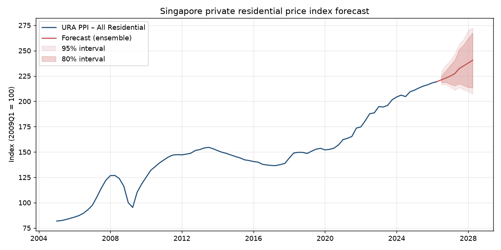
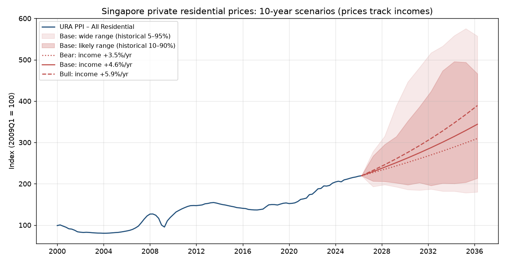

# Singapore private property price forecast

Four complementary models:

| | Question | Data | Model |
|---|---|---|---|
| **Index model** (`run_index_forecast.py`) | Where is the market going over the next 1–8 quarters? | URA Private Residential Property Price Index, 1975Q1–present (data.gov.sg, no key needed) | ARIMA, ridge, LightGBM, and an ensemble, with direct multi-horizon targets. Compared against random-walk and drift baselines |
| **Long-run scenarios** (`run_long_run.py`) | Where could prices be in 3–10 years? | Same index + SingStat nominal GDP, population and CPI (data.gov.sg) | Rule: prices grow with incomes. The scenarios are real income growth plus inflation, results come in future dollars and today's dollars, and the range comes from how far prices deviated from incomes in past decades |
| **Unit forecast** (`run_unit_model.py`, `run_unit_forecast.py`) | What is this condo unit worth now, and in 1–10 years? | ~600k condo sales since 1995 from propertynoob.com (not committed), OneMap geocoding, LTA MRT exits | Valuation from a transparent model and LightGBM, times the market path, times how condos of the same age and lease kept up with their region |
| **Hedonic model** (`run_hedonic.py`) | What is a specific unit worth? | URA private residential transactions (last ~5 yrs, [free URA API key](https://eservice.ura.gov.sg/maps/api/reg.html)) | LightGBM on log price per sqm. Features: project, segment (CCR/RCR/OCR), district, area, floor, tenure and remaining lease, location, sale date |

To combine them, the hedonic model prices a unit at today's market level and the index
forecast rolls that price forward (`hedonic.predict_future(model, units, index_growth=...)`).

## Quick start

```bash
pip install -r requirements.txt
python run_index_forecast.py                       # All Residential; also --series Landed / Non-Landed
python run_long_run.py                             # 3/5/10-year scenarios; --base 0.03 --inflation 0.02 etc.
python -m sgpf.propertynoob                        # collect condo sales (~2.5 h, resumable)
python run_unit_model.py                           # fit + test unit models
python run_unit_forecast.py artra "#12-05"         # one unit
python run_hedonic.py --ura-key YOUR_ACCESS_KEY    # needs a URA key
python -m pytest -q tests
```

Outputs are written to `outputs/`: backtest scores and predictions, the forecast table, and `forecast.png`.

## Results: index model, All Residential (data to 2026Q2)

Expanding-window backtest. Each quarter from 2010Q1 onward, the models are refit using only
the data available at that time. RMSE is in % log-growth; lower is better.

| Horizon | Random walk | ARIMA | Ridge | LightGBM | **Ensemble** |
|---|---|---|---|---|---|
| 1Q | 1.76 | 1.47 | 1.42 | 1.87 | **1.35** |
| 2Q | 3.08 | 2.35 | 2.29 | 3.64 | **2.22** |
| 4Q | 5.51 | **4.21** | 4.71 | 8.85 | 4.28 |
| 8Q | 9.74 | **8.24** | 22.61 | 16.59 | **8.24** |



## What the backtest shows

* **On ~200 quarterly points, a simple time-series model beats the ML models.** LightGBM
  never beats the random walk. Ridge helps only up to about a year. An 8-quarter direct
  target has only ~17 non-overlapping observations, so the ML models overfit. The ensemble
  therefore averages ARIMA and ridge up to h=4 and uses ARIMA alone beyond that. This split
  was chosen from the same backtest, so its scores are slightly optimistic. Because the
  model mix changes at h=5, the forecast path has a small kink between 2027Q2 and 2027Q3.
* **Policy regime features are risky for linear models.** Cooling measures began in 2009.
  In early backtest windows, ridge saw almost no variation in those features and
  extrapolated them to +50% 2-year forecasts. Ridge now drops them, and the tree models
  keep them.
* **Prediction intervals** come from the actual backtest errors at each horizon, not from
  model assumptions. They do not cover regime breaks such as new cooling measures, rate
  shocks or a GFC-style crash.

## Long-run scenarios (3–10 years)

### How it works

```
price in N years = price today × (income growth over N years) × historical deviation
income growth    = real income growth + inflation (CPI)
```

* **Income** is nominal GDP per resident (SingStat GDP divided by population). It is the
  strongest single driver of 10-year price growth since 1975 (correlation +0.86).
* **The central path has no fitted parameters:** prices grow at the same rate as incomes.
  Each scenario is a real income growth assumption plus an inflation assumption, both set
  to real decades since 1990:

  | Scenario | Real income growth per year | Inflation (CPI) per year | Nominal income growth | Where it comes from |
  |---|---|---|---|---|
  | Bear | 1.6% | 1.6% | 3.2% | Weakest real-income decade since 1990 |
  | Base | 2.9% | 1.6% | 4.6% | Median decade since 1990 |
  | Bull | 4.5% | 1.6% | 6.2% | Strongest decade since 1990 |

  The inflation default is the median decade since 1990 (range 0.6–2.6%). Use `--inflation`
  to override it.

* **Two units.** "Future dollars" is the price tag in that year. "Today's dollars" divides
  it by cumulative CPI inflation, i.e. purchasing power. In today's dollars the rule becomes
  *prices grow with real incomes*, so the inflation assumption changes the price tag but not
  the real result.
* **The range** comes from how far prices ran ahead of or behind incomes over the same
  horizon in every window since 1985. It covers everything the rule leaves out: rate cycles,
  cooling measures, supply gluts and crises. The same range applies in both units.

### Results (index today 219.4, data to 2026Q2)

| 10 years (2036Q2) | Future dollars | Today's dollars | Likely range, today's dollars |
|---|---|---|---|
| Bear | 301 (+37%) | 257 (+17%) | 159–348 (−27% to +59%) |
| **Base** | **343 (+56%)** | **293 (+33%)** | **182–397 (−17% to +81%)** |
| Bull | 399 (+82%) | 340 (+55%) | 211–461 (−4% to +110%) |

Base case at 10 years under different inflation: future dollars +42% (0.6%/yr), +56% (1.6%),
+73% (2.6%). In today's dollars it is +33% in every case.

**Context:** since 1990, real home prices grew about 1.7% a year in a typical decade, slower
than real incomes (2.9%). Real prices fell over the decades starting 1994–1996 and were flat
over the decade starting 2008. The central path assumes prices keep pace with incomes; the
historical range includes those weaker decades.

### Accuracy (out-of-sample, start dates 1985Q4 onward)

Average miss in percentage points of total price growth:

| Horizon | Flat forecast | Income growth known | Income guessed (last decade's pace) | "Likely" range held | "Wide" range held |
|---|---|---|---|---|---|
| 3 yrs | 28 | **19** | 23 | 76% (nominal 80%) | 84% (nominal 90%) |
| 5 yrs | 45 | **29** | 40 | 72% | 76% |
| 10 yrs | 74 | **43** | 61 | 68% | 69% |

The same test in today's dollars. Here the baseline is that prices just keep pace with
inflation, a tougher comparison:

| Horizon | Prices keep pace with inflation | Real income growth known |
|---|---|---|
| 3 yrs | 22 | **18** |
| 5 yrs | 34 | **27** |
| 10 yrs | 48 | **36** |

There are only about 3 non-overlapping 10-year windows since 1985, so the 10-year ranges
are rough. In testing they held about 7 times in 10, not the nominal 8 or 9 in 10. For the
same reason, the range edges move unevenly from year to year.

### Tested and rejected (they made out-of-sample error worse)

| Variant | 10-yr average miss |
|---|---|
| Income elasticity fitted freely (fitted value 2.2, driven by the 1975–1990 boom) | 47 (start dates from 1976); in a real-time test it undershot recent decades by 34 pts on average |
| Income growth plus a valuation correction (price/income vs its history) | 66 |
| Valuation correction plus supply pipeline (pipeline sign flipped, a sign of overfitting) | unstable; only ~2 decades of data |
| **Prices = incomes (chosen)** | **43** |

The inflation assumption itself has no measured error: it is an input. Interest rates are not modelled. data.gov.sg only has rate history from 1998 (bond yields)
and 2005 (other bank rates), which is too short to fit a 10-year relationship. Their effect is
inside the historical range.



## Unit forecast (individual condos)

```
value in N years = value today                 (valuation model)
                 × market growth to year N     (URA Non-Landed index: short-term model for
                                                years 1–2, then base-case income growth)
                 × relative performance        (how condos of this age and lease kept up
                                                with their region, per year)
```

### Data

603,137 single-unit condo, apartment and EC sales in 2,736 projects, 1995-01 to 2026-09, from
propertynoob.com. The feed is labelled `"source": "huttons"`. It is collected for personal
analysis and kept out of git. Project details come from the same site (tenure and lease
start, TOP, district, address). Location comes from OneMap and LTA MRT exits (91% of
postcodes geocoded).

### Valuation: two models, both explainable

* **Transparent model:** the project's recent sales (weighted toward the last ~6 months),
  then lookup-table adjustments for the region's market level, stack, floor, size, EC age
  and sale type. Each line in its breakdown is a % effect, for example:

  | Floor | 1–2 | 3–5 | 6–10 | 11–15 | 16–20 | 21–25 | 26–30 | 31–40 | 41+ |
  |---|---|---|---|---|---|---|---|---|---|
  | Effect | −4.7% | −2.6% | ref | +2.1% | +4.2% | +7.0% | +9.9% | +13.3% | +20.3% |

  | Size (sqft) | <500 | 500–650 | 650–800 | 800–1k | 1k–1.25k | 1.25k–1.5k | 1.5k–2k | 2k–3k | 3k+ |
  |---|---|---|---|---|---|---|---|---|---|
  | Effect on $psf | +24.5% | +12.6% | +5.5% | ref | −5.4% | −9.4% | −14.9% | −21.7% | −27.5% |

  New-launch sales carry a +5.6% premium over resales. ECs sell 18% below comparable condos
  before TOP and 13% below in their first 3 years.
* **LightGBM:** the same information plus location (district, coordinates, distance to MRT
  and CBD). Each valuation comes with the contribution of each factor (SHAP values).

**Accuracy.** The models were trained on sales up to 2026-03 and tested on 6,183 sales from
2026-04 to 2026-09. The way the two models are combined was chosen on a separate window
(2025-10 to 2026-03), not on the test window.

| Typical error (median), test window | New sales | Resales | Resales within 10% | 1 in 10 resales off by more than |
|---|---|---|---|---|
| Transparent | **2.2%** | 5.8% | 74% | 15.2% |
| LightGBM | 8.4% | **4.0%** | **88%** | 10.5% |

A unit forecast values the unit as a resale, so it uses LightGBM. The transparent breakdown
is shown alongside it as the explanation in plain lookup terms.

### Ageing and lease: did condos keep up with their region?

The model compares each project's growth over 5 years with the median project in its
region over the same years. Ageing and lease run-down cannot be separated from market
movement inside a valuation model, because age, lease and time all advance together; this
comparison sidesteps that.

| Group (% per year vs region, 5-year spans) | Effect | Projects |
|---|---|---|
| Freehold, 0–5 yrs old | −0.7% | 771 |
| Leasehold, 0–5 yrs old, 90+ yrs left | −0.9% | 335 |
| Leasehold, 5–15 yrs old, 80–90 yrs left | 0.0% to −0.3% | 181–269 |
| Freehold, 15–30 yrs old | +1.2% to +1.3% | 153–218 |
| Leasehold, 20–30 yrs old, 70–80 yrs left | +1.2% | 92 |
| Leasehold, 30+ yrs old, under 60 yrs left | +0.2% | 18 |

New condos lag their region as the launch premium fades. In this data, older leaseholds
have **not** clearly lagged. Two caveats: the groups with short leases are small, and condos
already sold en bloc are missing from the site. Survivors, and old condos that buyers expect
to go en bloc, may make old condos look better than a typical old condo really did.

### Ranges

Each range combines three independent sources in log terms, as the square root of the sum
of squares:

1. Valuation error: the 10th–90th percentile of resale errors in the test window.
2. The market range at that horizon.
3. Project-to-project spread within the age/lease group, scaled from the 5-year spans
   assuming deviations build up evenly.

Only the valuation part has been tested on its own. The combined ranges have not been
backtested.

### Example: Artra #12-05 (786 sqft, 12th floor, 99-yr lease from 2016, RCR)

See `outputs/unit_forecast_example.txt`. Value today is **S$1.83M** (80% range S$1.73M–2.01M).
Same-size units on floors 25 and 33 sold for S$1.945M–1.949M in mid-2026.

| Horizon | Future dollars | 80% range | Today's dollars |
|---|---|---|---|
| 1 yr | S$1.89M | 1.71–2.13M | S$1.87M |
| 5 yr | S$2.25M | 1.67–3.01M | S$2.08M |
| 10 yr | S$2.78M | 1.83–3.85M | S$2.37M |

## Possible next steps

* Add macro drivers to the short-term model (3M SORA or mortgage rates, unemployment,
  new-launch supply and the unsold pipeline, HDB resale index). This is likely the biggest
  gain, but the drivers must be forecast or lagged to avoid look-ahead.
* Backtest the combined unit-forecast ranges, for example by valuing units as at 2016 and
  comparing with their 2021 resale prices.
* Add en-bloc history (demolished projects) to remove survivorship bias from the ageing table.
* Forecast the region sub-indices (CCR/RCR/OCR) or a monthly index built from transactions,
  which gives about 3× more data points.
* Add amenity features to the hedonic model (distance to MRT stations and good schools).
  The URA `x`/`y` coordinates are SVY21 and can be joined to OneMap or LTA data.

Data: URA via data.gov.sg (Singapore Open Data Licence). This repository does not include
any URA transaction data.
